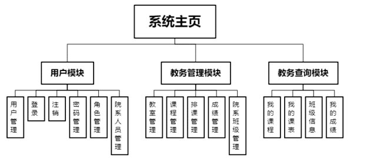
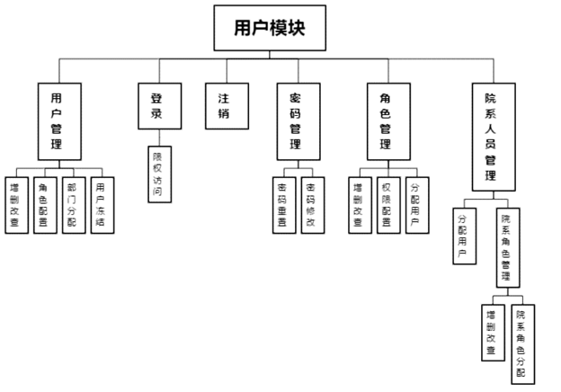
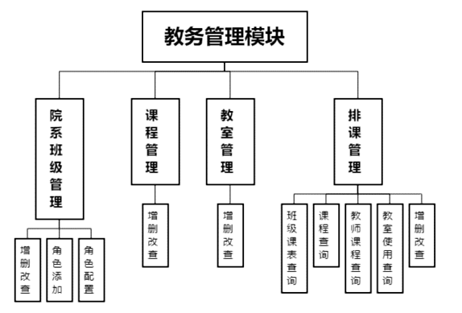
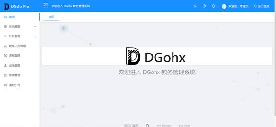
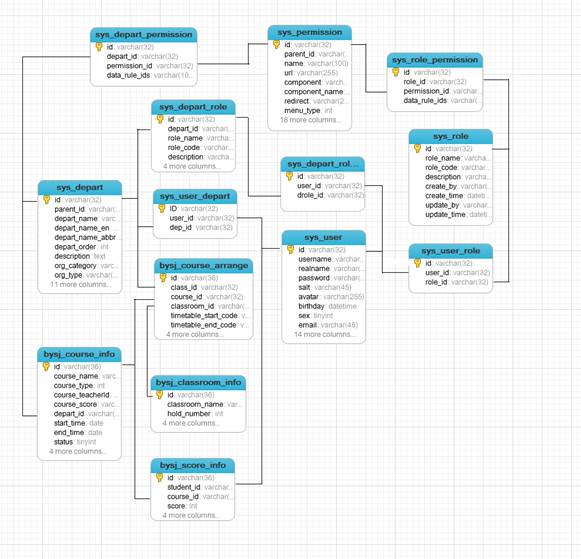

简介：
-----------------------------------

本项目是基于JeecgBoot ，一款基于代码生成器的J2EE快速开发平台，构建的一个简单教务管理系统。

项目系本人本科毕业设计课题内容，仅供学习交流，切勿用于其他用途。


技术架构：
-----------------------------------
### 开发环境

- 语言：Java 8

- IDE(JAVA)： IDEA 安装 lombok 插件 

- IDE(前端)： vsCode

- 依赖管理：Maven

- 数据库：MySQL5.7

- 缓存：Redis


### 后端
- 基础框架：Spring Boot 2.1.3.RELEASE

- 持久层框架：Mybatis-plus_3.1.2

- 安全框架：Apache Shiro 1.4.0，Jwt_3.7.0

- 数据库连接池：阿里巴巴Druid 1.1.10

- 缓存框架：redis

- 日志打印：logback

- 其他：fastjson，poi，Swagger-ui，quartz，lombok（简化代码）等。


### 前端

- [Vue 2.6.10](https://cn.vuejs.org/),[Vuex](https://vuex.vuejs.org/zh/),[Vue Router](https://router.vuejs.org/zh/)
- [Axios](https://github.com/axios/axios)
- [ant-design-vue](https://vuecomponent.github.io/ant-design-vue/docs/vue/introduce-cn/)
- [webpack](https://www.webpackjs.com/),[yarn](https://yarnpkg.com/zh-Hans/)
- [vue-cropper](https://github.com/xyxiao001/vue-cropper) - 头像裁剪组件
- [@antv/g2](https://antv.alipay.com/zh-cn/index.html) - Alipay AntV 数据可视化图表
- [Viser-vue](https://viserjs.github.io/docs.html#/viser/guide/installation)  - antv/g2 封装实现
- eslint，[@vue/cli 3.2.1](https://cli.vuejs.org/zh/guide)
- vue-print-nb - 打印


## 功能模块

```
├─系统管理
│  ├─用户管理
│  ├─角色管理
│  ├─菜单管理
│  ├─Online表单开发
│  └─数据字典
├─教务管理
|  ├─教室管理
|  ├─院系管理
│  └─发布通告
├─院系人员信息
├─课程管理
├─成绩管理
├─排课管理
├─通知公告
└─其他模块
   └─更多功能开发中。。
   
```

根据用户的角色信息，查询被授予的页面限权页面。根据返回的页面渲染出不同的功能页面。所有的功能可分为以下功能模块，如下图所示。



### 用户模块功能结构

用户模块是集中所有处理用户信息相关的模块，凡是与用户登录账户相关的所以功能均被包含在此模块中。如下图所示。



### 教务管理模块功能结构

教务管理功能模块包括院系班级管理，课程管理，排课管理，成绩管理，教室管理。如下图所示。



### 教务查询模块功能结构

教务查询功能模块包括我的成绩，我的课程，我的课表，班级信息。如下图所示。


## 界面



## 数据库

主要涉及表如下




关于JeecgBoot相关介绍和链接附上：

JEECG BOOT 低代码开发平台（前后端分离版本）
===============

当前最新版本： 2.3（发布日期：2020-09-14）


[](https://github.com/zhangdaiscott/jeecg-boot/blob/master/LICENSE)
[](http://www.jeecg.com)
[](https://github.com/zhangdaiscott/jeecg-boot)
[](https://github.com/zhangdaiscott/jeecg-boot)
[](https://github.com/zhangdaiscott/jeecg-boot)
